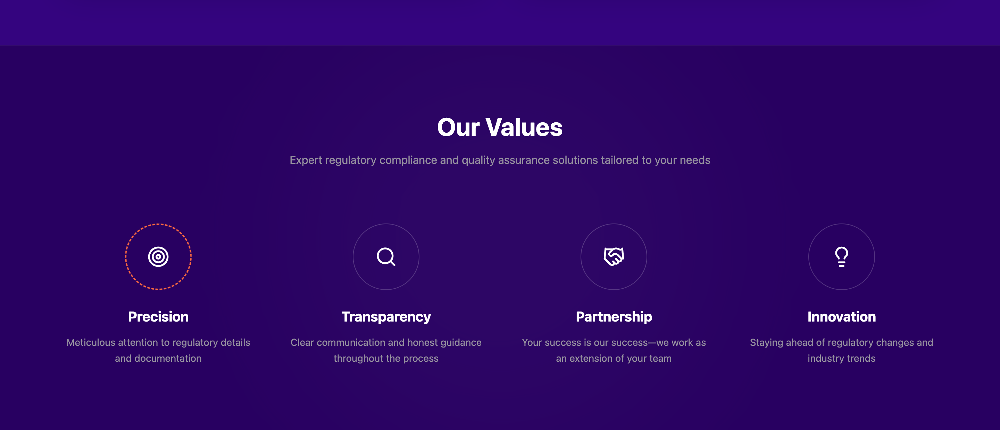
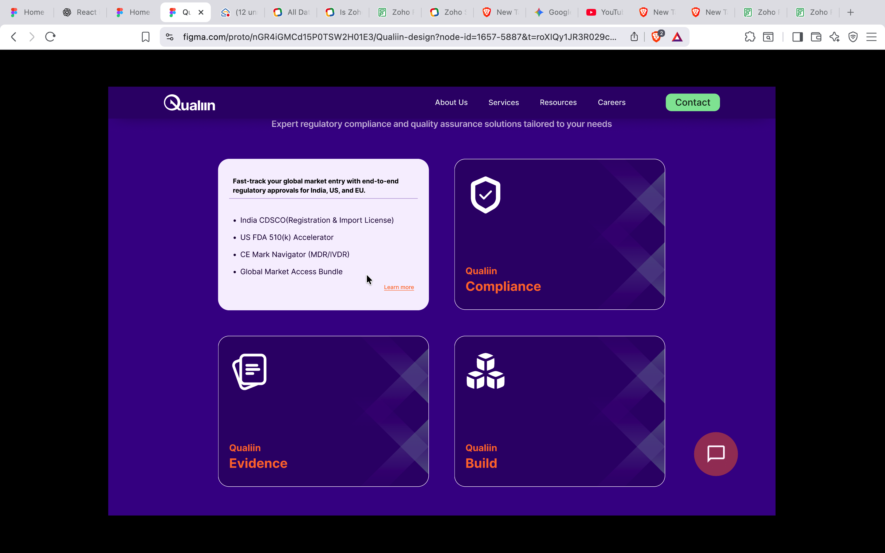
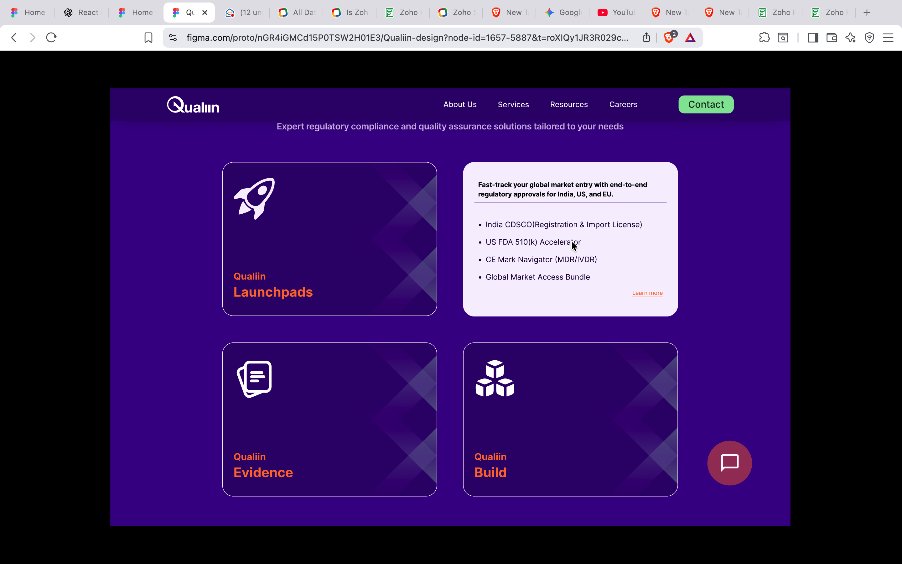
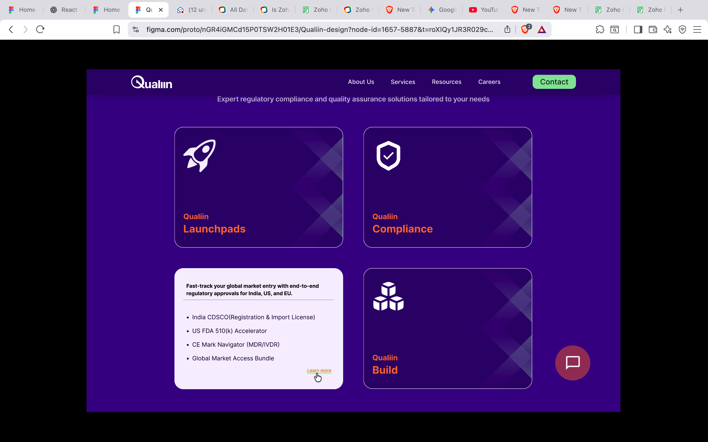
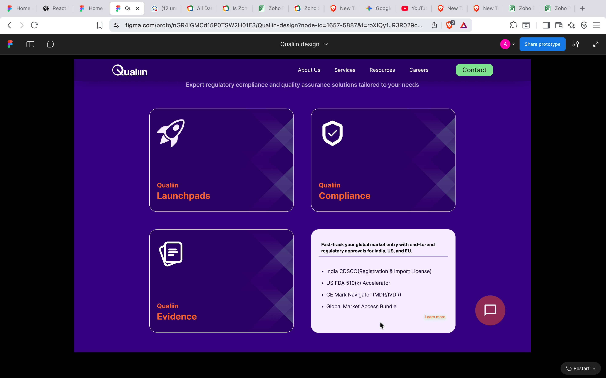
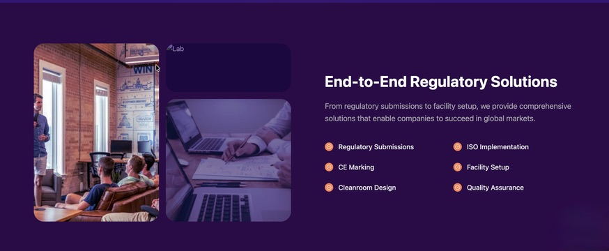
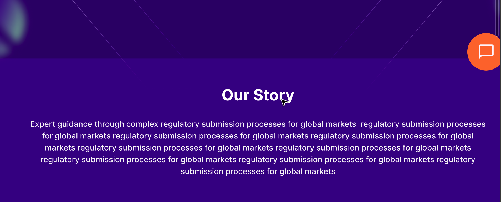

Keep everything same only add and remove the section as mentioned below.

Homepage changes:

Add section before our service section.

To our service section add the fliping effect when the move comes there and content for each fliped card.

1. Qualiin Launchpads:

2. Qualiin Compliance

3. Qualiin Evidence

4. Qualiin Build

Before schedule section add this section.

Our Story Page:

Add section before our service section.

add service section after it.

Remove our service section from our story page. Add our story section like this. 

Remove the industry we serve section and replace it with this.
Before schedule section add this section.
 

Current Homepage:
create a newpage called newsletter link:"qualiin.in/newsletter". No change copy the content as such.

    
